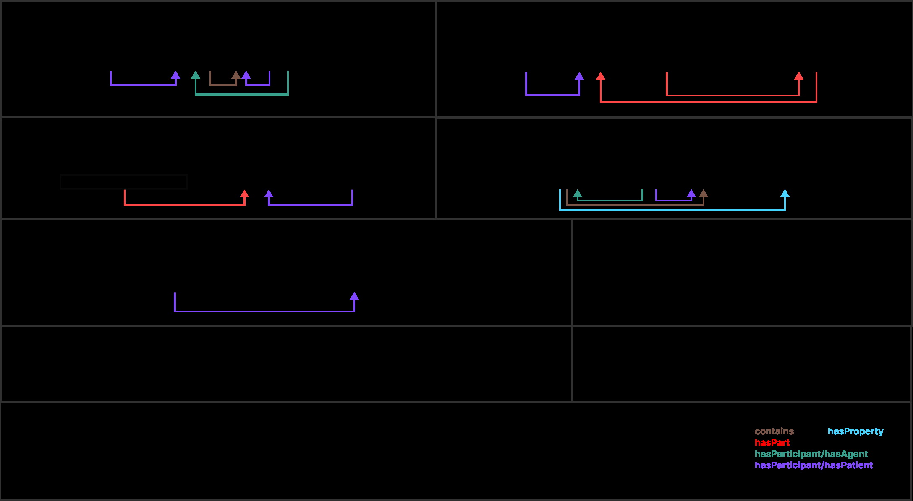
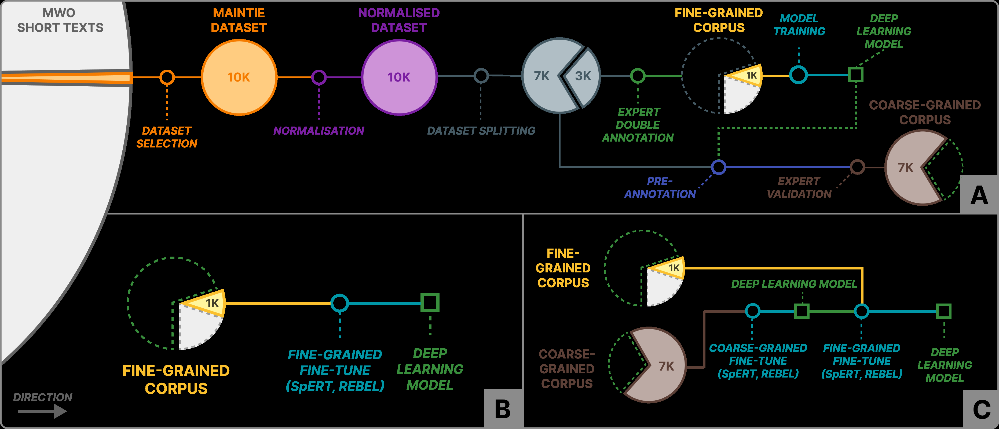
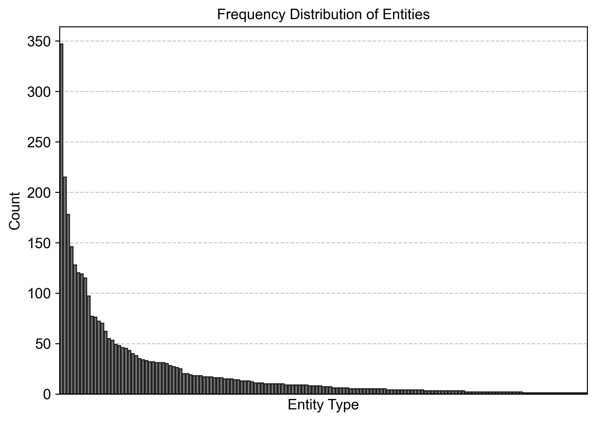
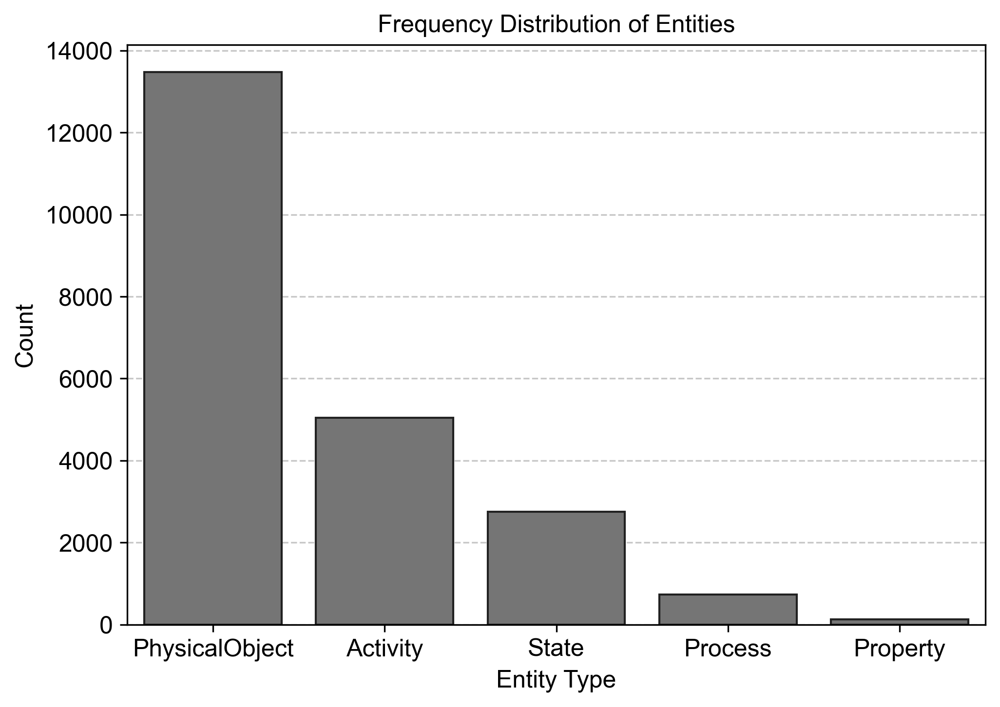
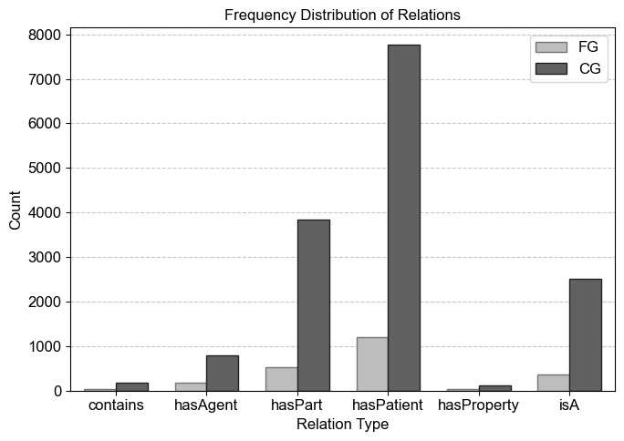

LREC-COLING 2024, pages 10939–10951
20-25 May, 2024. © 2024 ELRA Language Resource Association: CC BY-NC 4.0
10939
MaintIE: A Fine-Grained Annotation Schema and Benchmark for
Information Extraction from Maintenance Short Texts
Tyler Bikaun, Tim French, Michael Stewart, Wei Liu and Melinda Hodkiewicz
The University of Western Australia
Perth, Western Australia, Australia
{tyler.bikaun@research., tim.french@, michael.stewart@, wei.liu@, melinda.hodkiewicz@}uwa.edu.au
Abstract
Maintenance short texts (MST), derived from maintenance work order records, encapsulate crucial information in a
concise yet information-rich format. These user-generated technical texts provide critical insights into the state and
maintenance activities of machines, infrastructure, and other engineered assets–pillars of the modern economy.
Despite their importance for asset management decision-making, extracting and leveraging this information at
scale remains a significant challenge. This paper presents MaintIE, a multi-level fine-grained annotation scheme
for entity recognition and relation extraction, consisting of 5 top-level classes: PhysicalObject, State, Process,
Activity and Property and 224 leaf entities, along with 6 relations tailored to MSTs.
Using MaintIE, we have
curated a multi-annotator, high-quality, fine-grained corpus of 1,076 annotated texts. Additionally, we present a
coarse-grained corpus of 7,000 texts and consider its performance for bootstrapping and enhancing fine-grained
information extraction. Using these corpora, we provide model performance measures for benchmarking automated
entity recognition and relation extraction.
The MaintIE scheme, corpus, and model are publicly available at
https://github.com/nlp-tlp/maintie under the MIT license, encouraging further community exploration
and innovation in extracting valuable insights from MSTs.
Keywords: Information Extraction (IE), Named Entity Recognition (NER), Relation Extraction (RE), Mainte-
nance Work Orders (MWO)
1.
Introduction
Natural language processing (NLP) has advanced
significantly, with numerous datasets, such as
ACE (Doddington et al., 2004), CoNLL03 (Tjong
Kim Sang and De Meulder, 2003) and others, en-
abling automated text analysis. However, in the spe-
cific area of ‘engineering maintenance’, which deals
with the state and upkeep of engineered objects,
there is a notable scarcity of specialised datasets
and models (Brundage et al., 2021; Dima et al.,
2021).
Maintenance is an indispensable cornerstone in
today’s industrialised world, profoundly impacting
diverse sectors, including defence, energy, manu-
facturing, infrastructure, resources, and transporta-
tion. It accounts for billions of dollars in opera-
tional expenditure globally annually (Thomas, 2018;
Brundage et al., 2019). Within this essential do-
main, the short text field of ‘maintenance work order’
(MWO) records serves as a key medium for captur-
ing information about engineered objects, which we
refer to as maintenance short text (MST). These are
concise, user-generated texts, similar in brevity and
quality to a Tweet but with a medical note’s com-
plexity and technical nature (Figure 1) (Brundage
et al., 2021). The critical nature of these texts lies
in their support for domain experts in various an-
alytical tasks, such as equipment failure analysis
(Lee et al., 2023), root cause investigations (Val-
camonico et al., 2024), and the development of
performance indicators (Lukens et al., 2019).
Like semantic role labelling (Gildea and Jurafsky,
2002), the significance of information extraction
from MSTs hinges on deciphering “who is doing
what to what, and why?". Within this context, the
‘who’ may refer to either an engineered object or
a person, the ‘what’ pertains explicitly to an engi-
neering object and the ‘why’ reveals the condition or
state that necessitates the action on the entity. Take
the example: “replace the blown air conditioner mo-
tor". In this case, the extracted information would
ideally discern the following facts: (i) the air con-
ditioner has a part called the motor, (ii) the motor
is subject to the replace activity, and (iii) the motor
has the state of being blown. This type of semantic
comprehension is crucial for the practical analysis
and use of MSTs, as it explicitly identifies the object,
its parts, their condition and any required actions
identified in the MWO record.
Despite the significance of maintenance to the
economy, exploring MSTs from an information
extraction perspective remains under-researched
largely due to the limited publicly available anno-
tated datasets (Dima et al., 2021; Stewart et al.,
2022). Addressing this gap, this paper presents
MaintIE (Maintenance Information Extraction) – a
fine-grained scheme and two annotated corpora
for information extraction of MSTs.
MaintIE fo-
cuses on entity recognition and relation extraction
of low-quality MSTs that have been lexically nor-
malised. MaintIE is publicly available to facilitate
\n10940
Figure 1: An illustration of the MaintIE annotation scheme applied to lexically normalised maintenance
short texts. Italicised portions represent the original text, which is transformed into the larger text through
lexical normalisation and sanitisation. The entity prefix ‘PO’ indicates a PhysicalObject.
reproducible research and IE on MSTs1.
The remainder of this paper describes related
work (section 2), annotation scheme (section 3),
dataset selection and preprocessing (section 4),
annotation process (section 5), benchmark models
trained and evaluated using the annotated MaintIE
corpora (section 7), and finally, a discussion of the
results (section 8).
2.
Related Work
Engineering-specific texts, particularly in our area
of focus – maintenance short texts (MST), have
been used in NLP tasks such as text classifica-
tion, sentiment analysis, knowledge representation
and clustering (Stenström et al., 2015; Saetia et al.,
2019; Yang et al., 2020; Ottermo et al., 2021; Bhard-
waj et al., 2021; Usuga Cadavid et al., 2022; Iyer
et al., 2022). Existing research addressing IE for
MSTs has been limited to Named Entity Recog-
nition (NER). For example, the works of Sexton
et al. (2018); Navinchandran et al. (2021) intro-
duced a three-class NER system, distinguishing
entities as Problem, Item, and Solution. Similarly,
Gao et al. (2020) implemented a three-class NER
system based on Item, Action, and State, echoing
the classification approach of the prior authors. Ad-
vancing from these foundational studies, Stewart
et al. (2022) expanded the categorisation with a
ten-class NER system, broadening the scope to
1https://github.com/nlp-tlp/maintie
Activity, Agent, Attribute, Cardinality, Consumable,
Item, Location, Observation, Specifier, and Time.
Using a pretrained bidirectional short-term mem-
ory (LSTM) model with character-level embeddings,
Stewart et al. (2022) achieved an impressive 82.8%
micro F1 on a dataset comprising 4,000 annotated
entities on MSTs.
While the named entities in existing works can
identify the “who," “what," and “why" in MSTs, they
do not provide a complete semantic comprehen-
sion of the complex dynamics within these texts.
To answer questions like “who is doing what to
what, and why?" we need to extract inter-entity
relations (Jurafsky, 2000), which is the focus of
relation extraction (Pawar et al., 2017). However,
relation extraction for MSTs is still in its early stages,
with the only notable attempt being one by Stew-
art et al. (2022), which employs unsupervised co-
occurrence-based heuristics for generating inter-
entity relationships. Nevertheless, there is a grow-
ing interest in constructing semantic graphs from
technical engineering-specific texts (Sarica et al.,
2020; Bhardwaj et al., 2023; Wang and El-Gohary,
2023); however, these are yet to be applied to
MSTs.
There are several significant challenges when
it comes to IE on MSTs. Firstly, there is a lack
of publicly available annotated IE datasets, with
only one corpus being released by Stewart et al.
(2022). This is because MWOs are often confi-
dential, and organisations are hesitant to release
their data (Akhbardeh et al., 2020; Bikaun et al.,
\n
\n10941
2024). Additionally, human annotation of technical
texts like MSTs is expensive and requires significant
subject-matter expertise and tacit knowledge (Set-
tles, 2009). Secondly, MSTs often have poor quality
language (Stenström et al., 2015; Hodkiewicz and
Ho, 2016; Akhbardeh et al., 2020; Bikaun et al.,
2024), requiring subject-matter expertise for text
normalisation (Bikaun et al., 2021). Addressing
pre-processing and quality issues is essential to
ensure optimal performance of downstream tasks
(van der Goot et al., 2021). Lastly, the existing en-
tity schemes used for MSTs can be suboptimal for
IE since they are shallow and rely on general classi-
fications such as “Item" and “Activity" to categorise
nouns and verbs (Sexton et al., 2018; Gao et al.,
2020; Navinchandran et al., 2021; Stewart et al.,
2022). This overuse of general classification results
in a loss of specificity, leading to challenges when
disambiguating texts in downstream engineering
applications.
3.
Annotation Scheme
This section outlines the MaintIE annotation
scheme, with its entity classes and relations briefly
described in Table 1. In developing the scheme,
we are guided by eight design requirements out-
lined in the repository. These requirements were
established to ensure that the scheme is efficient,
expressive, and easily understood by all stakehold-
ers – ranging from annotators to the domain experts
who engage with the scheme and its outputs. Fur-
ther details pertaining to the MaintIE scheme can
be found by consulting the repository.
Entities
MaintIE features 224 distinct entity
classes across 3 levels, organised under 5 primary
hierarchical categories: PhysicalObject, State, Pro-
cess, Activity, and Property. An illustrative depic-
tion of these classes is available in Figure 1. Main-
tIE adopts a systems engineering approach to anno-
tation of physical objects utilising the inherent func-
tion of objects as the basis for item classification
(Stone and Wood, 1999). This allows for directly
using the function-based object classification sec-
tion in the IEC 81346-2:2019 standard (IEC, 2019).
Moreover, MaintIE borrows from established ontolo-
gies for state and activity classifications (Woods
et al., 2021, 2023).
Relations
MaintIE presents four distinct cate-
gories of relations: mereological, property, type,
and participatory. Participatory relations are in-
spired by PropBank’s (Kingsbury and Palmer, 2002)
agent (ARG0) and patient (ARG1) labels accessed
via the Unified Verb Index2.
These labels are
semantically defined as Proto-Agent properties
(Dowty, 1991).
As MaintIE uses a closed set
of typed entities, these labels have been trans-
formed into the semantic relations hasParticipant/
hasAgent and hasParticipant/ hasPatient to cap-
ture the participation of entities as agents, causes,
or experiencers, as well as those undergoing a
change of state or being affected by actions. For
a visual representation of these relations, please
refer to Figure 1.
4.
Dataset and Preprocessing
The dataset used for MaintIE contains 10,000 MSTs
randomly sampled from MWOs on assets used in
the heavy mobile equipment, rail, mineral process-
ing and infrastructure industries (Figure 2A). This
random sampling exposes the scheme to a range of
heavy-industry maintenance contexts. The domain-
expert annotators, who are the first and last authors,
also have direct work experience in these indus-
tries.
As described in the section 2, MSTs texts have
poor lexical quality and also make considerable
use of abbreviations and acronyms that are of-
ten unique to the company or maintenance con-
text. The open-source annotation tool LexiClean
(Bikaun et al., 2021) was used by a domain ex-
pert familiar with lexical normalisation and indus-
trial maintenance (first author) to lexically normalise
and sanitise the MaintIE corpus following the guide-
lines outlined by Bikaun et al. (2024). Confidential
and non-semantic information is masked with the
special tokens <id>, <sensitive>, <num> and
<date>, while non-standard words and phrases
are normalised into their canonical forms. Follow-
ing this process, the texts are tokenized based on
white space before semantic annotation. Figure
1 illustrates the outputs of this transformation pro-
cess.
5.
Annotation Process
This section outlines the process of annotating enti-
ties and relations in the MaintIE dataset (see Figure
2A). The task was performed by two domain ex-
perts, the first and last authors, who have over 30
years of combined experience in engineering and
maintenance and are knowledgeable about entity
and relation annotation. They used QuickGraph
(Bikaun et al., 2022), a freely available tool, for the
annotation task.3 The annotators identify textual
2Unified Verb Index. https://verbs.colorado.
edu/verb-index/index.php
3QuickGraph.
https://quickgraph.nlp-tlp.
org
\n10942
Entity Type (Size)
Brief Description
Example
Activity (1 →2 ⇒20)
Activities related to maintenance and support tasks per-
formed on physical objects, based on Woods et al. (2023).
change out, overhaul,
jump-start
PhysicalObject
(1 →19 ⇒173)
Function-based classification of physical objects based on
IEC 81346-2:2029 (IEC, 2019).
pump, engine, gasket
Process (1 →2)
Temporal events relating to physical object function or con-
dition.
leaking, weeping
Property (1 →2)
Attributes of a physical object, either essential (intrinsic) or
accidental (non-intrinsic) (Robertson and Atkins, 2013).
crack, hole, pressure,
temperature
State (1 →2 ⇒3)
Conditions of physical objects based on (Woods et al.,
2021).
blown, seized
Relation Type
Brief Description
Example
contains
Mereological: Denotes containment of physical objects.
engine contains oil
hasPart
Mereological: Represents part-whole relationships of phys-
ical objects.
engine has part radia-
tor
hasParticipant/hasAgent
Participatory: Represents entities actively involved or ini-
tiating an action or event. Equivalent to PropBank agent
(ARG0) role (Kingsbury and Palmer, 2002).
leak has agent pump
hasParticipant/hasPatient
Participatory: Denotes entities passively affected by or
undergoing an action or event. Equivalent to PropBank
patient (ARG1) role (Kingsbury and Palmer, 2002).
leak has patient water
hasProperty
Property: Indicates the possession of a particular charac-
teristic or attribute by an entity.
pipe has property tem-
perature
isA
Type: Describes a subtype or instance relationship be-
tween entities.
diesel engine is a en-
gine
Table 1: An overview of the entities and relationships within the MaintIE scheme. For in-depth details,
consult the repository. Size represents the hierarchical structure for each top-level entity class.
spans corresponding to entities and assign a hier-
archical entity type to each. If applicable, relations
between the annotated entities are then applied.
An example item from the annotated MaintIE cor-
pus is shown in Appendix 10.1.
The project was allotted 6 weeks for annota-
tion by the two subject-matter experts, during
which 3,000 texts were randomly sampled from
the 10,000 texts to be annotated. Both annota-
tors worked independently using the entire 224 en-
tity classes and 6 relations, meeting for two hours
weekly to resolve issues and develop annotation
guidelines. The agreement between the annota-
tors was measured through the F1 score (van Ri-
jsbergen, 1979) on entities, strict relations, and
loose relations. An entity agreement was counted
when both annotators agreed on the entity’s span
and type.
A strict relation agreement required
both annotators to recognise the identical relation
type and match both the head and tail entity types
and spans, while a loose relation agreement was
reached when both annotators aligned on the re-
lation type and the spans of the head and tail enti-
ties. Only texts that had perfect agreement were
included in the final expert-annotated corpus. After
6 weeks, 1,400 texts were double annotated, and
1,067 achieved 100% agreement. These texts are
included in the “Fine-Grained Expert-Annotated"
gold-standard MaintIE corpus. The entire process
took approximately 60 total hours, averaging 2.5
minutes per text.
The Fine-Grained Expert-Annotated corpus was
used to train a deep learning model (section 7). The
output of this model “pre-annotated" the remaining
7,000 texts (see Figure 2A), resulting in a second,
coarse-grained annotated corpus with only the 5
top-level entity classes and 6 relations. To complete
this process, we used the SpERT model (Eberts
and Ulges, 2020), which was trained on the 5 top-
level classes of the fine-grained corpus. We opted
for this approach due to the scarcity of resources
for annotation and the time-consuming nature of
annotating the full-depth hierarchy. The purpose of
the coarse-grained corpus is to determine whether
using it as an additional training resource produces
better fine-grained results due to enhanced entity
and relation identification.
A single domain expert (first author) then used
QuickGraph to correct residual annotation errors,
resulting in the “Coarse-Grained Large-Scale" cor-
pus. The coarse-grained annotation process on
the pre-annotated corpus was much faster, taking
approximately 40 hours to complete, due to the sig-
nificantly fewer entity classes involved, averaging
25 seconds per text. Future work will explore using
crowd-sourcing or equivalent to increase the size
of this corpus with finer-grained entity classes.
\n10943
6.
Annotated Corpora Statistics
This section presents a summary of the statistics
for both annotated MaintIE corpora. A total of 8,076
texts were annotated, encompassing 43,674 tokens
with a vocabulary size of 2,409. The distribution
of tokens per text ranged from a minimum of 1 to
a maximum of 13, with an average of 5.4. Table 2
summarises the statistics for both corpus portions,
while Appendix 10.2 details the entity and relation
distributions across each.
6.1.
Fine-Grained Expert-Annotated
The Fine-Grained Expert-Annotated corpus com-
prises 1,067 texts with 100% annotator agreement
on both entities and relations. MaintIE fine-grained
has 3,397 annotated entities (301 unique) with an
average number of 3.2 entities per text. This ac-
counts for 55.6% of the corpus tokens being as-
signed an entity. The number of relations is lower
than that of entities, likely because relations require
two entities to exist. A total of 2,341 relations (1,757
unique) were applied, with 38.3% of tokens partic-
ipating in a relation. All 1,076 texts have at least
two entities and one relation.
6.2.
Coarse-Grained Large-Scale
The Coarse-Grained Large-Scale corpus consists
of 7,000 texts pre-annotated using a deep learn-
ing model trained on the fine-grained corpus (see
Figure 2A). The annotations were manually vali-
dated by a single annotator (first author) without
inter-annotator agreement metrics to report. The
corpus was annotated at the coarsest entity level,
using only the 5 top-level entity classes and the
same relations used in the fine-grained corpus.
This coarse-grained corpus contains 22,122 en-
tities (3,298 unique) and 15,200 relations (12,898
unique).
7.
Experiments and Evaluation
7.1.
Task Description
The main objective of MaintIE is to extract en-
tities (E
=
{e1, ..., en}) and relations (R
=
{r1(en, em), ..., rn(en, em)}) expressed in an MST
with both coarse and fine-grained annotations. In
our experiments, we explore the performance of to-
ken classification (using SpERT (Eberts and Ulges,
2020)) and sequence-to-sequence methods (us-
ing REBEL (Cabot and Navigli, 2021)). The aim of
both methods is to accurately identify and assign
the appropriate hierarchical entity type to textual
spans, as well as recognise and classify inter-entity
relations. In this context, relations can exist be-
tween any entity, and entities can be nested at any
arbitrary depth. To evaluate the performance of this
task, we use micro and macro-F1 scores measured
on entities and relations (loose and strict) following
Eberts and Ulges (2020) and Cabot and Navigli
(2021).
7.2.
Models
SpERT
Span-Based Joint Entity and Relation
Extraction with Transformer Pre-Training (SpERT)
(Eberts and Ulges, 2020) operates as a token-
classification model designed to extract entities and
relations jointly. For this study, our implementation
integrates SpERT with BERT (bert-base-cased)
(Kenton and Toutanova, 2019). We adhered to the
default hyperparameters, with the sole exception
being the maximum span length, adjusted to 32.
REBEL
The Relation Extraction By End-to-end
Language generation (REBEL) (Cabot and Nav-
igli, 2021) model extracts entities and relations as
triples from text using an autoregressive sequence-
to-sequence mechanism.
This approach en-
codes semantic triples into a reversible linearised
structure.
REBEL is pre-trained over BART
(facebook/bart-large) (Lewis et al., 2020) for rela-
tion extraction from a large subset of Wikipedia arti-
cles. Despite its exceptional performance on bench-
mark datasets, REBEL has a drawback in that it
cannot extract entities without relations; hence, we
only evaluate this model on its RE performance.
For the most part, we have kept the default hyper-
parameters but have made specific adjustments
to the maximum source and target lengths, setting
them to 64.
7.3.
Experimental Setup
We evaluated each model’s ability to extract enti-
ties and relations with different hierarchies, ranging
from coarse to fine, and tested their performance
using the two annotated (fine and coarse-grained)
corpora. Our primary goal is to produce a perfor-
mance baseline for information extraction on MSTs.
A secondary goal is to see if using the coarse-
grained corpus improves the model’s fine-grained
extraction performance. Establishing a baseline for
information extraction performance across different
levels of entity hierarchy enables us to compare
MaintIE against existing works.
To conduct the experiments, we used two model
training strategies (illustrated in Figure 2): fine-
tuning on the fine-grained corpus (FG Fine-Tune)
and pre-fine-tuning on the coarse-grained corpus
followed by fine-tuning on the fine-grained corpus
(CG Fine-Tune →FG Fine-Tune). We studied the
effect of entity hierarchy on extraction, ranging
\n10944
Figure 2: Workflows for MaintIE corpora creation (top) and experimental procedures (bottom): (A) Steps for
developing Expert-Annotated and Large-Scale corpora. (B) Fine-tuning using only the Expert-Annotated
corpus. (C) Fine-tuning using both MaintIE corpora.
from untyped4, the coarse-grained level (5 classes),
the intermediate level (32 classes), and the finest-
grained level of 224 classes. For model training,
development and testing, we used an 80/10/10
split on both corpora. Table 4 summarises the ex-
perimental results. Further details of the training
strategies can be found in the repository.
8.
Discussion
In this section, we explore the key outcomes of
implementing our annotation scheme, the develop-
ment of the two corpora, and the performance of
the benchmark models.
8.1.
Annotation Scheme and Corpora
The key distinguishing features of the MaintIE en-
tity scheme are its multi-level structure, alignment
with international standards for classifying engi-
neered objects (IEC, 2019), and re-use of estab-
lished ontologies for state and activities (Woods
et al., 2023). In practice, annotating entities with a
fine-grained corpus (of 224 classes) presents cer-
tain challenges, particularly with the bottom-level
subclasses of State and PhysicalObject. This is
due to the terse nature of the texts – 5.4 tokens
on average. These texts often lack the context
to disambiguate and situate named entities (e.g.
‘cable’ in ‘replace cable’ – is this a guiding or struc-
tural physical object?). Annotators often have to
cross-check with external resources and reference
material to corroborate correct entity classes. In the
future, fortuitous information accompanying MSTs
4one class (Entity) for SpERT and two classes
(<subj>, <obj>) for REBEL.
(Brundage et al., 2021) could be used to contextu-
alise the texts and improve the annotation process.
These issues are less pronounced when annotat-
ing the coarse-grained corpus, as only the top 5
levels of entity classes were used, which are easily
differentiable and less ambiguous.
Of the 224 possible fine-grained entity classes,
only 69.6%, or 156, were used in this corpus, pri-
marily due to the comprehensive nature of the IEC
81346 functional hierarchy. This standard, intended
to encompass all engineered assets, extends be-
yond the scope of our dataset, which is focused on
mining operations’ assets. This focus has resulted
in a skewed distribution of physical object entities
(illustrated in Appendix 10.2). This phenomenon
presents challenges for task-specific learning by
limiting the diversity of entities represented. Such
a distribution underscores the need for corpus re-
finement to reflect better the varied and complex
nature of maintenance activities across different
industries.
Expanding the MaintIE corpus to include mainte-
nance contexts from a broader range of engineered
systems, such as those in the building or electronics
industries, promises to increase its representative-
ness and utility substantially. This diversification
strategy not only aims to address the noted limita-
tions but also enriches the corpus, making it a more
versatile resource for research and application in
the wider field of maintenance engineering. Includ-
ing diverse maintenance scenarios could provide
a more holistic view of engineered asset manage-
ment, significantly advancing the corpus towards
achieving greater universality and relevance.
The MaintIE scheme differs from previous work
in the domain due to its unique set of relations.
\n
\n10945
Table 2: Summary statistics of the two annotated MaintIE corpora. Density refers to the number of tokens
with the specified annotation type. Schema utilisation refers to the proportion of the schema applied to
the dataset.
Fine-Grained Expert-Annotated (1,076 texts)
Coarse-Grained Large-Scale (7,000 texts)
Entity
Relation
Entity
Relation
Total
3,397
2,341
22,122
15,200
Min. / Text
2
1
0
0
Max. / Text
6
6
7
7
Ave. / Text
3.2
2.2
3.2
2.2
Median / Text
3
2
3
2
Texts w/ Annotations
100%
100%
99.7%
96.1%
Annotation Density
55.6%
38.3%
58.9%
40.5%
Schema Utilisation
69.6% (156/224)
100% (6/6)
100% (5/5)
100% (6/6)
Table 3: Summary of entity and relation annotations in the annotated MaintIE corpora. Entity types are
consolidated into their top-level classes for succinctness. For in-depth details, consult the repository.
Fine-Grained Expert-Annotated
Coarse-Grained Large-Scale
Total
Unique
Total
Unique
#
Entity Type
Count
%
Count
%
Count
%
Count
%
1
Activity
784
23.1
27
9.0
5,045
23.0
373
11.0
2
PhysicalObject
1,994
58.7
222
73.7
13,472
61.0
2,379
72.0
3
Process
146
4.3
9
3.0
728
3.0
118
4.0
4
Property
35
1.0
1
0.3
130
1.0
32
1.0
5
State
438
12.9
42
14.0
2,747
12.0
396
12.0
Total
3,397
100
301
100
22,122
100
3,298
100
Total
Unique
Total
Unique
#
Relation Type
Count
%
Count
%
Count
%
Count
%
1
contains
38
1.6
15
0.9
178
1.2
137
1.1
2
hasPart
533
22.8
417
23.7
3,837
25.2
3,290
25.5
3
hasParticipant/hasAgent
166
7.1
127
7.2
789
5.2
716
5.6
4
hasParticipant/hasPatient
1,206
51.5
936
53.3
7,761
51.1
6,745
52.3
5
hasProperty
34
1.5
28
1.6
123
0.8
116
0.9
6
isA
364
15.5
234
13.3
2,512
16.5
1,894
14.7
Total
2,341
100
1,757
100
15,200
100
12,898
100
Through our relation annotation, 17,541 relations
were created across both MaintIE corpora. This ef-
fort has produced a comprehensive set of relations
for MSTs and is the only human-annotated, freely
available set in this domain. Relation annotation
is challenging, especially for the fine-grained cor-
pus, as getting an entity annotation wrong means
the relation is also wrong when measured strictly.
The original 1,400 double annotated texts had inter-
annotator agreement scores, as measured by F1
score, of 91.8% for entities, 64.1% for strict rela-
tions, and 75.5% for loose relations. These less
than 100% scores reflect the lack of agreement
on 333 texts, as the remainder (1,067) have a per-
fect agreement. We decided to discard texts with
non-perfect agreement from the corpus as they
may have introduced inconsistency. Moreover, only
annotating 1,400 of the original 3,000 texts allot-
ted was due to the time limits on the annotation
process.
During the annotation process, applying mereo-
logical, property, and type inter-entity relations was
generally straightforward. However, most relation
annotations, approximately 60%, as shown in Ta-
ble 3, are participatory relations, which can present
challenges. It is sometimes difficult to identify en-
tities participating in the patient and agent roles.
Many verbs and verb phrases are domain-specific
and not captured in resources like VerbNet or Prop-
Bank. Additionally, it is challenging to disambiguate
the main participants of the short texts even when
the PropBank roleset is identified, as these texts
lack proper grammatical structure and are concise.
For example, in annotating the nouns “pulley" and
“lagging" in “change out pulley lagging" and “change
out pulley - lagging worn". Annotator agreement
\n10946
Table 4: Results of automatic information extraction, represented as F1 scores. Bold text indicates the
overall best-performing scores on the 224 entity classes. Underlines indicate the best score for the given
model and training strategy. Abbreviations: ER (entity recognition), RE (relation extraction), FG (Fine-
Grained Expert-Annotated corpus), and CG (Coarse-Grained Large-Scale corpus). For comprehensive
results of the top-performing models, refer to Appendix 10.3.
Model
Fine Tuning Strategy
Entity Classes
ER
RE Strict
RE Loose
Micro
Macro
Micro
Macro
Micro
Macro
REBEL
FG (Figure 2B)
2
Not Relevant
68.9
69.7
68.9
69.7
5
67.9
57.3
68.3
57.4
32
0.8
0.6
69.0
70.2
224
0.0
0.0
66.7
53.5
CG →FG (Figure 2C)
2
Not Relevant
73.7
73.7
73.7
73.3
5
69.0
70.9
70.7
71.1
32
37.4
51.1
71.1
72.5
224
0.0
0.0
76.1
77.3
SpERT
FG (Figure 2B)
1
89.9
89.9
72.9
74.7
72.9
74.7
5
87.4
88.8
67.1
62.3
68.3
62.6
32
71.6
58.9
36.5
42.8
65.5
61.9
224
64.4
38.7
27.3
35.1
55.7
61.1
CG →FG (Figure 2C)
1
89.8
89.8
73.9
76.4
73.9
76.4
5
89.5
92.0
72.4
75.6
72.8
75.7
32
67.1
50.9
31.0
46.3
71.6
71.7
224
55.4
27.0
15.5
26.5
71.4
72.7
metrics and reconciliation processes are key to
consistency in situations like this. Despite these
challenges, we are confident that MaintIE repre-
sents the most extensive annotated dataset cur-
rently available for maintenance texts (Akhbardeh
et al., 2020).
8.2.
Benchmark Models
The annotated MaintIE corpora was used to facil-
itate automated IE for engineering maintenance
texts and explore the performance of two promi-
nent deep learning architectures for entity and rela-
tion extraction: SpERT, a token classification model
(Eberts and Ulges, 2020), and REBEL, a sequence-
to-sequence model (Cabot and Navigli, 2021). We
assessed these models’ adaptability to different en-
tity hierarchy sizes and the potential enhancement
in fine-grained IE performance when incorporating
the coarse-grained corpus for additional fine-tuning.
The results, presented in Table 4 and Appendix
10.3, are insightful. As the entity hierarchy expands,
there is a reduction in entity recognition efficiency.
Yet, the models demonstrated proficiency in relation
extraction across the board, as evident from their
F1 scores. As expected, untyped models, which
classify one or two entity types only, outperformed
others, whereas models operating on the complete
224-class entity hierarchy have lower performance.
Notably, the sequence-to-sequence model failed
for strict relation extraction at the 32 and 224 entity
class granular levels. Such performances are likely
influenced by the limited corpus size, the diversity
of entity classes, and imbalances (details in Table
3), emphasising the challenging nature of this task,
even when dealing with short texts.
Our observations suggest that pre-fine-tuning on
the coarse-grained corpus (Figure 2C) before tran-
sitioning to the fine-grained corpus can enhance
performance. Nevertheless, the magnitude of this
enhancement varies depending on the metrics ap-
plied. For instance, relation extraction performance
for the sequence-to-sequence model increased
from 0.6 to 51.1 (macro RE Strict) and 70.2 to 72.5
(macro RE Loose) at the 32-class level. The token
classification model presented the opposite trend.
This difference is likely due to the model architec-
tures and how they learn from data. While REBEL’s
performance improved with additional training data,
which assisted in contextualising the MST from
its pretraining corpus, SpERT encountered a de-
cline. This decrease was likely attributed to the fact
that during the coarse-grained fine-tuning phase,
SpERT established dominant weights for the five
top-level classes, making it challenging to re-adjust
when subsequently fine-tuned on the fine-grained
corpus.
The corpus characteristics, notably the long-tail
distribution of entities, present a substantial chal-
lenge to the IE algorithms. The detailed distribution
of entities in the hold-out test set, as illustrated in
Appendix 10.2, accentuates the task’s complexity.
Despite these challenges, the MaintIE dataset’s
efficacy in relation extraction from short mainte-
\n10947
nance texts unveils promising avenues for enhanc-
ing technical support and information retrieval for
domain experts, along with opportunities for tax-
onomy extraction and a deeper understanding of
asset performance.
While the primary intent of this paper is to intro-
duce the MaintIE scheme and its annotated data
rather than to develop models of exceptional per-
formance, we offer these models as prospective
benchmarks against which future model perfor-
mance can be assessed. Future investigations
might explore the use of the entity hierarchy to im-
prove entity recognition performance, refine the
training strategies to further take advantage of the
coarse-grained corpus, or constrain the generation
process of the sequence-to-sequence model for op-
timised entity recognition similar to Josifoski et al.
(2022).
9.
Conclusion and Future Work
This paper introduced MaintIE, an annotation
scheme for extracting information from the low-
quality short text field of maintenance work orders.
Two annotated corpora were presented: a fine-
grained expert-annotated corpus of 1,076 texts
comprising 224 entity classes and 6 relations and
a coarse-grained large-scale corpus consisting of
7,000 texts comprising 5 classes and 6 relations.
The use of these corpora for automated information
extraction was explored by training two benchmark
deep learning models using token classification
and sequence-to-sequence architectures, respec-
tively. The best models achieved over 70% mi-
cro and macro F1-scores. Future work seeks to
add data and annotations to the MaintIE corpus for
the entities not present in the current maintenance
short texts by reaching out to other engineering
sectors and further exploring training strategies to
make use of coarse-grained corpora to improve
fine-grained entity and relations-focused informa-
tion extraction.
10.
Acknowledgements
This research is supported by the Australian Re-
search Council through the Centre for Transforming
Maintenance through Data Science (grant number
IC180100030). Additionally, Bikaun acknowledges
funding from the Mineral Research Institute of West-
ern Australia.
Appendices
10.1.
Appendix A: Example of Data
This section presents a JSON example from the
MaintIE corpus, providing a representative glimpse
of the data’s structure and format.
{
"tokens": [
"engine",
"oil",
"blender",
"running",
"constantly"
],
"entities": [
{
"start": 2,
"end": 3,
"type": "PhysicalObject/
MatterProcessingObject/
MixingObject"
},
{
"start": 0,
"end": 1,
"type": "PhysicalObject/
DrivingObject/
CombustionEngine"
},
{
"start": 3,
"end": 5,
"type": "Process/
UndesirableProcess"
},
{
"start": 1,
"end": 3,
"type": "PhysicalObject/
MatterProcessingObject/
MixingObject"
}
],
"relations": [
{
"type": "hasPart",
"head": 1,
"tail": 3
},
{
"type": "hasPatient",
"head": 2,
"tail": 3
},
{
"type": "isA",
"head": 3,
"tail": 0
}
]
}
10.2.
Appendix B: Distribution of Entity
and Relation Annotations
This section illustrates the distribution of entity and
relation annotations in the two MaintIE corpora.
\n10948
Figure 3: Fine-Grained Expert-Annotated corpus:
Distribution of entity annotations.
Figure 4: Coarse-Grained Large-Scale corpus: Dis-
tribution of entity annotations.
Figure 5: Comparative distribution of relation anno-
tations across Fine-Grained Expert-Annotated and
Coarse-Grained Large-Scale corpora.
10.3.
Appendix C: Detailed Model
Results
This section provides comprehensive results from
chosen models to enhance understanding of their
performance. Detailed entity recognition results
are excluded here due to the extensive range of
labels but are fully available in the accompanying
repository.
Type
Prec.
Recall
F1
Support
contains
0
0
0
3
isA
0
0
0
20
hasPatient
0
0
0
137
hasProperty
0
0
0
5
hasAgent
0
0
0
8
hasPart
0
0
0
61
macro
0
0
0
234
micro
0
0
0
234
Table 5: Test set performance summary of optimal
REBEL model (CG →FG) on strict relation extrac-
tion: Evaluation across 224 entity classes.
Type
Prec.
Recall
F1
Support
contains
100
100
100
3
isA
37
75
49
20
hasPatient
81
85
83
137
hasProperty
80
80
80
5
hasAgent
86
75
80
8
hasPart
75
69
72
61
macro
73
79
76
234
micro
76
81
77
234
Table 6: Test set performance summary of optimal
REBEL model (CG →FG) on loose relation extrac-
tion: Evaluation across 224 entity classes.
Type
Prec.
Recall
F1
Support
contains
100
100
100
3
isA
31
25
28
20
hasPatient
35
21
26
137
hasProperty
0
0
0
5
hasAgent
33
25
29
8
hasPart
34
23
27
61
macro
34
23
27
234
micro
39
32
35
234
Table 7: Test set performance summary of opti-
mal SpERT model (FG) on strict relation extraction:
Evaluation across 224 entity classes.
11.
Bibliographical References
Farhad Akhbardeh, Travis Desell, and Marcos
Zampieri. 2020. MaintNet: A collaborative open-
source library for predictive maintenance lan-
guage resources. In Proceedings of the 28th
\n

